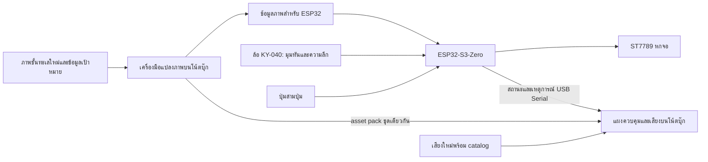

# แผนระบบ

เจ้าของแผน: Astra · 10 กันยายน 2026

## 1. ประสบการณ์ที่ต้องได้

ผู้เล่นอยู่ด้านหน้าฐานและกวาดภาพปลา/ทะเลผ่านเป้าเล็ง ภาพไม่ได้เลื่อนชดเชยมุมหมุน ล้อเปลี่ยนระดับทะเล ปุ่ม Scan ตรวจสิ่งที่อยู่ในเป้า ปุ่ม Collect เก็บภาพตัวอย่างขึ้นจอคอม และปุ่ม Analyze เปิดรายละเอียดตัวอย่างที่เลือก จอคอมทำหน้าที่เป็นแผงควบคุมเรือดำน้ำและเล่นเสียงตามเหตุการณ์

ขั้นนี้การกวาดภาพมาจากล้อ ไม่ใช่การหมุนตัวลูกจริง เพราะไม่มีเซนเซอร์วัดการหมุนในชุดที่ได้มา ดูเหตุผลในหัวข้อ 4

ความหมายของ 360 องศาคือภาพต่อรอบในแนวนอน ไม่ใช่การหมุนสายไฟได้ไม่จำกัดรอบ ไม่จำเป็นต้องเพิ่มมอเตอร์ slip ring บอร์ดตัวที่สอง หรือลำโพงในชิ้นงาน

ผู้ใช้ประกอบฮาร์ดแวร์เอง ฝั่งซอฟต์แวร์ต้องส่งผังขาที่ใช้งานได้และภาพหมายเลขจอให้ประกอบตาม ไม่ออกแบบ CAD แทนผู้ใช้

## 2. โครงระบบที่เลือก



ESP32 เป็นเจ้าของสถานะการเล่น ภาพ และการตรวจว่ามีเป้าหมายใต้เป้าหรือไม่ โน้ตบุ๊กแสดงแผงควบคุม เก็บภาพตัวอย่าง แสดงรายละเอียด และเล่นเสียง ไม่ส่งภาพเต็มหกจอผ่าน USB และโปรแกรมโน้ตบุ๊กหลุดต้องไม่ทำให้ภาพค้าง

เริ่มด้วย C++ / Arduino-ESP32 และไลบรารี Adafruit ST7789 โดยใช้ hardware SPI บัสเดียว CS แยกหกเส้น DC/RST แชร์ได้เมื่อเขียนทีละจอ ผู้เขียนโค้ดล็อกเวอร์ชัน dependency หลัง build ผ่านจริง ห้ามคาดเดาว่าคอนฟิกบอร์ด generic จะตรงกับหน่วยความจำของ S3-Zero

โปรแกรมโน้ตบุ๊กใช้ Python, Tkinter, Pillow, pySerial และ pygame สำหรับเสียง ทำแผงควบคุมใหม่ในโปรแกรมเดียว ใช้ serial reader ที่ไม่บล็อก UI แล้วส่งเหตุการณ์เข้าคิว UI ไม่เปิดหลายโปรแกรมแย่ง COM เดียวกัน

## 3. ภาพชั้นทะเลแบบคลี่

- ภาพต้นฉบับแรกขนาด 1024×512 พิกเซล X เป็นทิศรอบตัวและวนกลับได้ Y เป็นระดับจากผิวน้ำลงทะเลลึก
- ภาพประกอบด้วยสีแสงและชั้นทะเล สิ่งมีชีวิต และบริเวณเป้าหมายที่แยก metadata จากภาพ ไม่ใช้การตรวจสีพิกเซลเพื่อเดาว่าเป็นปลาอะไร
- ภาพวาดใหม่แบบเรียบง่ายใช้เริ่มระบบได้ก่อนภาพสวย ห้ามใช้ภาพ/เสียงเดิม การใส่ชื่อชนิดสัตว์หรือระดับความลึกจริงต้องมีข้อมูลใหม่ที่ยืนยันได้; ช่วงทดสอบเคยใช้ชื่อเช่น target_01 และระดับ 0–100 โดยระบุว่าเป็นค่าจำลอง ตั้งแต่ LUNA-04 เป็นต้นไป ภาพชุดจริงมาพร้อมชื่อบรรยายทั่วไป เช่น `luna04_manta_ray` label "manta ray silhouette" ซึ่งยังไม่ใช่ชื่อสปีชีส์และไม่อ้างความลึกจริง
- ระดับความลึกควบคุมหน้าต่างแนวตั้งบนภาพ เปลี่ยนความลึกแล้วทุกหน้าต้องแสดงระดับเดียวกัน
- ขอบ X ซ้าย–ขวาต้องต่อเนื่อง ขอบ Y ต้อง clamp เพื่อไม่อ่านเกินภาพ
- ไม่มีการสตรีมวิดีโอ ไม่มี LLM/TTS และไม่มีฉาก Three.js ในงานขั้นแรก

### วิธีแมพลงลูกบาศก์

ระบุหน้าหกด้านเป็น `px`, `nx`, `py`, `ny`, `pz`, `nz` หรือ +X, -X, +Y, -Y, +Z, -Z แล้วมี config จับคู่กับ CS และทิศติดตั้งจริงอีกชั้นหนึ่ง ห้ามสมมติว่าบัดกรีเรียงสายเท่ากับเรียงทิศภาพ

แต่ละหน้ามีเวกเตอร์ normal, ทิศขวาของพิกเซล, ทิศลงของพิกเซล และขอบเขต active image บนหน้าจริง ค่า active image ต้องเผื่อตำแหน่งภาพที่เยื้องบน PCB และกรอบ ไม่ยืดภาพ 240×240 ให้แทนทั้งหน้าลูกบาศก์โดยไม่คำนึงถึงกรอบ

สำหรับแต่ละพิกเซล แปลงตำแหน่งบนหน้าจอเป็นจุดบนหน้าลูกบาศก์ แล้วเป็นทิศจากศูนย์กลางลูก ใช้มุมแนวนอนเลือก U ของภาพ และมุมแนวตั้งร่วมกับความลึกเลือก V ตารางการวางลูกบาศก์ตั้งบนมุมเป็นค่าคงที่ ทำให้หน้าบน/ล่างแมพถูกโดยไม่แบ่งภาพเป็นหกสี่เหลี่ยมเท่า ๆ กัน

สูตรตัวอย่างเพื่อกำหนดข้อตกลง ไม่ใช่เฟิร์มแวร์สำเร็จ:

```text
d0 = normalize(Q * point_on_cube_face)
u = wrap(atan2(d0.y, d0.x) / (2*pi) + u_offset)
v = clamp(depth_window_center - pitch(d0) * vertical_scale)
```

Q คือการวางลูกบาศก์ตั้งบนมุมที่ตำแหน่งเริ่มต้น ที่สำคัญ: สูตรพื้นหลังนี้ไม่มีค่ามุมหมุนมือ จึงไม่ทำให้ภาพทะเลหมุนสวนตัวลูก

`vertical_scale` เป็นการกำหนดพื้นที่ที่มองเห็นในภาพชั้นทะเล ไม่ใช่คำรับรองว่าภาพนี้เป็นภาพถ่ายทรงกลมที่ถูกต้องทางแสง

## 4. เป้าเล็งอยู่ด้านหน้าเสมอ

### แหล่งที่มาของมุมหัน เมื่อไม่มีเซนเซอร์วัดการหมุน

แผนเดิมจะใช้ AS5600 อ่านมุมหมุนของตัวลูก แต่**ชุดที่ได้มาไม่มีทั้งตัว AS5600 และแม่เหล็กขั้วขวาง** การวัดการหมุนตัวลูกจึงไม่มีอยู่ในต้นแบบนี้ ไม่ใช่ปัญหาการต่อสายและไม่มีค่าตั้งใดแก้ได้ ผู้ใช้ตัดสินใจตัดและยอมรับสภาพ

ต้นแบบตั้ง `yaw.source = none` (มุมหันคงที่) เป็นค่าที่คอมไพล์อยู่จริงใน `deep_sphere_config.h` และตรงกับ `config/controls.json` กับ `config/board.json` เพราะยังไม่เปิดใช้อินพุตกายภาพ ส่วน `encoder` (ล้อ KY-040 เป็นตัวหมุนมุมหัน กดล้อสลับหน้าที่ระหว่างความลึกกับมุมหัน) เป็นทางที่เตรียมไว้สำหรับตอนเปิดใช้ปุ่ม/ล้อจริง คณิตศาสตร์ทั้งหมดไม่เปลี่ยน เพราะ yaw ยังเป็นตัวแปรเดียวกัน เปลี่ยนเฉพาะว่าใครเป็นคนป้อนค่า ผลที่เสียไปคือการหมุนตัวลูกจริงไม่ถูกอ่าน ผู้เล่นหมุนภาพแทนการหมุนลูก

`yaw.source` ของบอร์ดมีสองค่า `none` (ค่าปัจจุบัน มุมหันคงที่) และ `encoder` เฟิร์มแวร์ไม่มีโค้ดของเซนเซอร์วัดการหมุนเหลืออยู่ บนแผงคอม ลูกศรซ้าย/ขวาเดินมุมหันของตัวจำลองครั้งละ 5 องศา และ state ที่ส่งออกจะรายงาน `yaw_source: "keyboard"` เพื่อไม่ให้ถูกอ่านสลับกับค่าที่มาจากเซนเซอร์ ค่านี้เป็นของฝั่งคอมเท่านั้น ไม่ใช่ค่าที่บอร์ดรายงาน ถ้าวันหนึ่งซื้อทั้งเซนเซอร์และแม่เหล็กมา สิ่งที่ต้องทำอยู่ท้าย `config/wiring-table.md` ทุกอย่างที่อยู่หลัง `gYawDeg` ใช้ได้เหมือนเดิม

ผลพลอยได้: เมื่อ yaw มาจาก encoder ค่าที่ได้เป็นขั้นละเอียดคงที่ ไม่มีสัญญาณสั่นแบบเซนเซอร์แอนะล็อก จึงไม่ต้องใส่ hysteresis กันเป้าสลับหน้าไปมา ถ้าวันหนึ่งมีเซนเซอร์แอนะล็อกต้องใส่กลับ

### เรขาคณิต

กำหนดแกนโลก Z ขึ้นด้านบน และทิศจากศูนย์กลางไปหาผู้เล่นด้านหน้าฐานเป็นค่าคงที่ `aim_world` อ่าน yaw จากแหล่งที่ตั้งไว้ พร้อม zero offset และเครื่องหมายทิศจากการติดตั้งจริง

```text
aim_body = transpose(Q) * rotate_z(-yaw) * aim_world
```

ยิงเส้นจากศูนย์กลางตาม `aim_body` หาจุดตัดหน้าลูกบาศก์ แปลงจุดตัดกลับเป็นพิกเซลบน active image ของหน้านั้น แล้ววาดเป้า ขณะหมุนให้คืนพื้นหลังบริเวณเป้าเก่าก่อนวาดใหม่เพื่อไม่ทิ้งรอย

UV ของเป้าบน atlas ต้องเป็นค่าเดียวกับที่ renderer วาดไว้ตรงพิกเซลนั้น ไม่ใช่การแปลงพิกัดบนหน้าจอเป็น UV อีกชุดหนึ่ง เพราะทิศของเป้าคือ `rotate_z(aim_world, -yaw)` อยู่แล้ว จึงได้ `atlas_uv = background_uv(rotate_z(aim_world, -yaw), depth)` ตรงตัว มี test vector ชุดเดียวกันบังคับให้ Python กับ C++ ให้ค่าเท่ากัน

ห้ามใช้ yaw อย่างเดียวแบ่งทุก 60 องศาแล้ววาดตรงกลางจอ เพราะไม่ได้รักษาตำแหน่งเป้าจริงบนลูกบาศก์เอียง ใช้กฎเลือกหน้าที่แน่นอนบริเวณเส้นแบ่ง โดยเลือกหน้าจาก dot ที่มีเครื่องหมาย ไม่ใช่ค่าสัมบูรณ์ ซึ่งจะเลือกหน้าตรงข้ามผิดข้าง ส่วน hysteresis ยังไม่ต้องใส่ตราบใดที่ yaw มาจาก encoder ตามหัวข้อข้างบน

### ข้อจำกัดจากกรอบจริง

ถ้าจุดตัดอยู่บนกรอบที่ไม่มีพิกเซล จะวาดเป้าตรงจุดนั้นไม่ได้ กติกาขั้นแรกคือซ่อนเป้าเมื่ออยู่นอก active image ปิดการ hit ในช่วงนั้น และให้เป้ากลับมาเมื่อผ่านเข้าจอถัดไป ไม่กระโดดไปกึ่งกลางจอแล้วอ้างว่าเป้ายังคงตำแหน่งเดิม

ถ้าผู้ใช้ต้องการเป้ามองเห็นต่อเนื่องแม้ผ่านกรอบ ต้องตัดสินใจเปลี่ยนรูปแบบเป้าเพิ่มเติม แยกจากงานซอฟต์แวร์หลักนี้

เป้ายึดด้านหน้าฐาน ไม่ติดตามคนที่เดินรอบชิ้นงาน; ไม่มีกล้องหรือระบบติดตามผู้เล่น

## 5. การสแกนและตัวควบคุม

หน้าที่อินพุตที่ผู้ใช้ยืนยันแล้ว:

| อินพุต | ผล |
|---|---|
| ล้อ KY-040 โหมด heading | เปลี่ยนมุมหัน จึงเปลี่ยนหน้าจอ/ตำแหน่งเป้า พื้นหลังไม่ขยับในพิกัดตัวลูก |
| ล้อ KY-040 โหมด depth | เปลี่ยน depth_norm 0–1 และตำแหน่งหน้าต่างแนวตั้ง |
| กดล้อ KY-040 | สลับหน้าที่ล้อระหว่าง depth กับ heading (เฉพาะเมื่อ `yaw.source = encoder`) |
| Scan | ตรวจ target metadata ณ UV ใต้เป้า ส่ง hit หรือ miss |
| Collect | ตรวจเป้าหมาย ณ ตอนกด แล้วส่ง sample_id และตำแหน่งภาพให้คอมเก็บตัวอย่าง ถ้าไม่พบส่งเหตุผลไม่สำเร็จ |
| Analyze | ให้คอมแสดงรายละเอียดตัวอย่างที่เลือกบนแผง หรือชิ้นล่าสุดถ้ายังไม่เลือก ไม่มีตัวอย่างให้แสดงข้อความแนะนำ |

การสแกนและเก็บต้องใช้ UV เดียวกับ renderer หลังรวม depth offset และการกลับ/หมุนหน้าจอแล้ว เพื่อไม่ให้ภาพเห็นปลาแต่ระบบตรวจตำแหน่งอื่น มี cooldown และ debounce ไม่ส่งเสียงซ้ำทุกเฟรม ไม่สร้างเงื่อนไขว่าต้องกด Scan ก่อน Collect เว้นแต่ผู้ใช้ขอเพิ่ม

### ภาพที่เก็บและจอแผงควบคุม

- จัดหน้าจอเป็นส่วนสถานะความลึก/การเชื่อมต่อ ผล Scan ภาพตัวอย่างที่เลือก คลังตัวอย่าง และรายละเอียด Analyze ใช้โทนเครื่องมือเรือดำน้ำโดยไม่ใส่มาตรวัดปลอมที่ระบบไม่ได้อ่านจริง
- แผงไม่ใช่ live video ของจอหกใบ: Collect สำเร็จแล้วภาพตัวอย่างใหม่ปรากฏและถูกเก็บไว้ ดูย้อนหลังได้แม้ล้อเปลี่ยนระดับหรือหมุนลูกไปแล้ว
- เครื่องมือสร้าง asset pack ส่งภาพที่ quantize แบบเดียวกับบอร์ดและ targets metadata ให้ทั้งสองฝั่ง พร้อม asset_pack id ที่ตรวจตรงกันก่อนแสดงตัวอย่าง
- Collect ส่งตำแหน่ง crop ใน atlas, target_id และ depth ณ ตอนกด คอมตัดภาพจาก asset pack เดียวกันแล้วบันทึก PNG กับ metadata ใหม่ ภาพนี้คือภาพตัวอย่างจากบริเวณที่เก็บบน atlas ไม่ใช่ภาพถ่ายจากกล้องหรือ screenshot perspective ของทั้งหน้าจอ
- ภาพที่บันทึกต้องเป็นสำเนาที่คงเดิม ไม่คำนวณใหม่จาก depth ล่าสุดเมื่อเปิดดู เก็บรายการ sample และ PNG ไว้ใน `output/samples/` โหลดกลับได้เมื่อเปิดโปรแกรมใหม่
- ถ้า asset pack ไม่ตรงกันหรือไม่มี ให้แสดงข้อผิดพลาดของภาพตัวอย่าง ไม่เดารูปจาก target_id และไม่อ้างว่าได้ภาพถูกต้อง
- Analyze แสดงภาพ ชื่อ/รหัสตัวอย่าง ระดับที่เก็บ และข้อมูลที่มีใน metadata ไม่เพิ่ม LLM หรือข้อมูลชีววิทยาที่แต่งขึ้น ใช้ placeholder ที่ระบุชัดได้จนกว่าจะมีข้อมูลจริง
- ถ้าเก็บขณะคอมไม่เชื่อมต่อ ไม่อ้างว่าบันทึกสำเร็จลงคอมแล้ว ขั้นแรกไม่ต้องทำคิวภาพย้อนหลัง ให้มีสถานะรอคอมและข้อความเมื่อเชื่อมใหม่

ระหว่างยังไม่มีเซนเซอร์หรือจอครบ มีโหมดรับมุม/ความลึกจำลองสำหรับตรวจคณิตศาสตร์เท่านั้น ต้องระบุสถานะ simulated ชัดเจน ห้ามใช้แทนหลักฐานว่าชุดจริงผ่านแล้ว

## 6. หน่วยความจำและการวาด

รุ่น S3-Zero ปกติมี PSRAM 2MB และ Flash 4MB ตามผู้ผลิต ต้องตรวจรุ่นที่ได้รับและค่ารันจริงตอนเริ่มโปรแกรม

เพดานเริ่มต้น:

| ข้อมูล | ขนาดประมาณ |
|---|---:|
| Atlas 1024×512 RGB565 | 1,048,576 bytes |
| บัฟเฟอร์ภาพหนึ่งจอ 240×240 RGB565 | 115,200 bytes |
| บัฟเฟอร์ส่งทีละ 16 แถว | 7,680 bytes |

อย่าเก็บ framebuffer เต็มหกใบพร้อม atlas และ LUT เต็มทุกพิกเซล ถ้าต้องการ LUT ให้ใช้ตารางหยาบหรือคำนวณทีละแถวและวัดผลจริง บัฟเฟอร์ DMA ต้องอยู่ในหน่วยความจำที่ไดรเวอร์รองรับ

เริ่มวาดพื้นหลังครบทุกจอหนึ่งครั้ง การหมุนอัปเดตเฉพาะบริเวณเป้าเก่า/ใหม่ การเปลี่ยนความลึกวาดพื้นหลังทุกจอเป็นชุดให้จบ แล้วใช้สถานะที่แสดงจริงสำหรับ hit test ไม่ให้สแกนภาพเก่าด้วยระดับใหม่ระหว่างวาดไม่ครบ

ตั้งเป้าอ่านอินพุตต่อเนื่องและให้เป้าตอบสนองเห็นได้ทันการหมุน ค่าความเร็ว SPI และเฟรมเรตต้องมาจากการวัดจริง ไม่ยืมตัวเลขรับรองจาก BOM เก่า ลดความเร็วบัสได้โดยไม่เปลี่ยน logic เกม

## 7. แผงควบคุม เสียง และทางไฟ

ใช้ USB CDC ส่งสถานะ Scan/Collect/Analyze และเหตุการณ์เสียงตาม [audio-protocol.md](audio-protocol.md) ส่งคำอธิบาย crop สำหรับภาพที่เก็บ ไม่มีไฟล์เสียงหรือภาพเต็มถูกส่งผ่านโปรโตคอลขณะเล่น

การใช้ USB เส้นเดียวกับโน้ตบุ๊กทำให้ทางไฟต่างจากการเสียบหัวชาร์จผนังที่คุยไว้ก่อนหน้า ต้องเลือกแหล่งจ่ายให้ชัด: USB โน้ตบุ๊ก/ฮับที่จ่ายไฟได้เพียงพอเป็นทางแรก และให้ผู้ประกอบตรวจโหลดครบจอ ห้ามขนานไฟ 5V จากหัวชาร์จเข้ากับ VBUS โน้ตบุ๊กโดยตรง

หากทางไฟ USB ไม่พอ ให้รายงานก่อนเปลี่ยนการต่อ ทางสำรองที่ไม่ต้องส่งภาพหรือเพิ่มบอร์ดคือใช้หัวชาร์จเดิมและส่งเหตุการณ์เสียงผ่าน Wi-Fi แต่ไม่ต้องเขียนเส้นทางสำรองจนมีเหตุจำเป็น

Serial ไม่เชื่อมต่อ โปรแกรมเสียงปิด หรือไม่มีไฟล์เสียง ต้องยังหมุนจอและเล่นได้ โปรแกรมเสียงเริ่มต้นใหม่ให้ขอสถานะปัจจุบัน ไม่ต้องรีเซ็ตชิ้นงานเพื่อให้ ambience กลับมาถูกระดับ

## 8. แหล่งเทคนิคที่ใช้ยืนยันแผน

ใช้เฉพาะข้อมูลอุปกรณ์และเครื่องมือ ไม่ดึงเนื้อหาหรือข้อกำหนดจากโครงการอื่น:

- [Waveshare ESP32-S3-Zero](https://docs.waveshare.com/ESP32-S3-Zero): หน่วยความจำ พอร์ต และขาบอร์ด
- [Espressif USB CDC](https://docs.espressif.com/projects/arduino-esp32/en/latest/tutorials/cdc_dfu_flash.html): การใช้ native USB สำหรับสื่อสาร
- [Adafruit ST7735/ST7789 library](https://github.com/adafruit/Adafruit-ST7735-Library): จุดเริ่มต้นไดรเวอร์จอ
- [pySerial](https://pyserial.readthedocs.io/en/latest/shortintro.html): โปรแกรมรับเหตุการณ์บนโน้ตบุ๊ก
